# 版本截图

## `v6.6.0` 小程序综合应用

## `v6.5.0` 轮播图和开关选择器

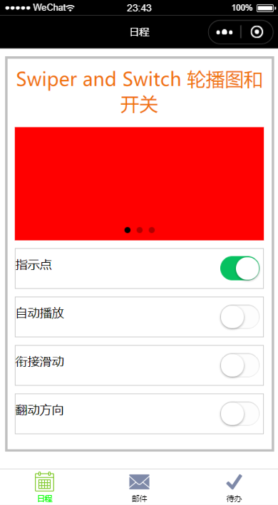

##  `v6.4.0` 滑动条和颜色

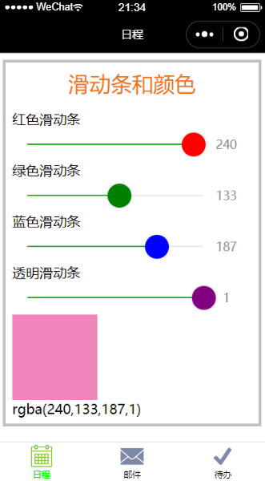

## `v6.3.0` 通过checkbok和redio组件来改变字体的样式

## `v6.2.0` 根据三角形三边长度求解三角形的面积

## `v6.1.0` 汇率计算器

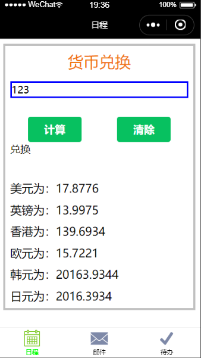

## `v5.6.0` 单元作业按照四种方向打印99乘法表

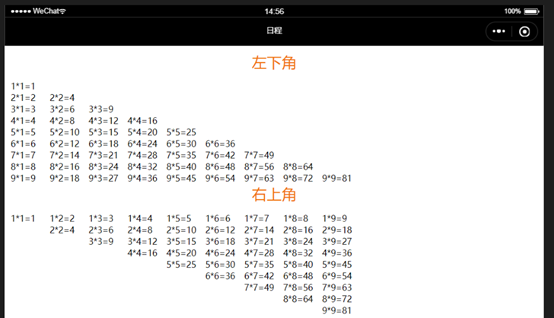

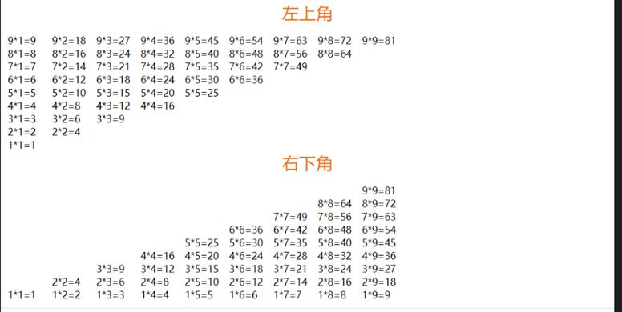

## `v5.5.0` 利用include引用文件

## `v5.4.0` 模板的定义和引用

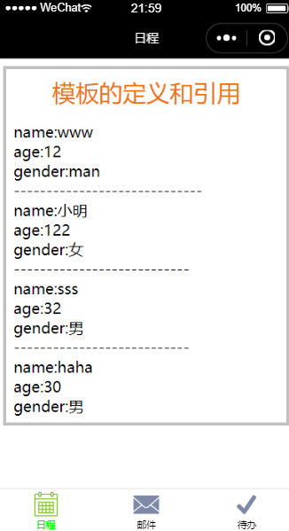

## `v5.3.0` 9*9乘法表完成

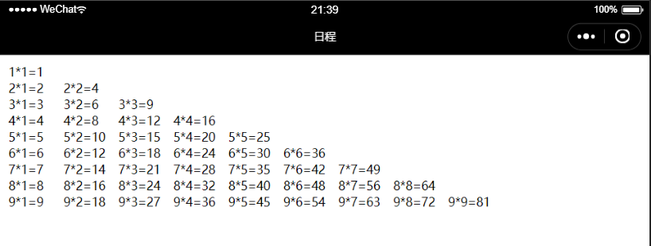

## `v5.2.0` 列表渲染

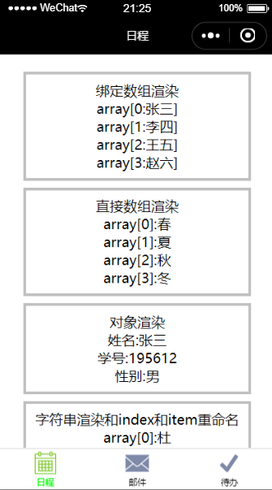

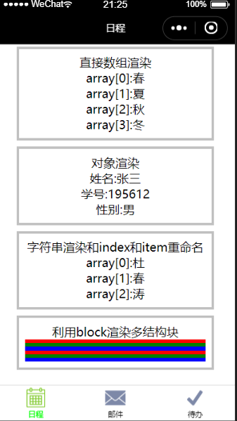

## `v5.1.0` 成绩等级计算器：条件渲染

## `v4.6.0` 设计tabbar作业四

## `v4.5.0` 条件渲染

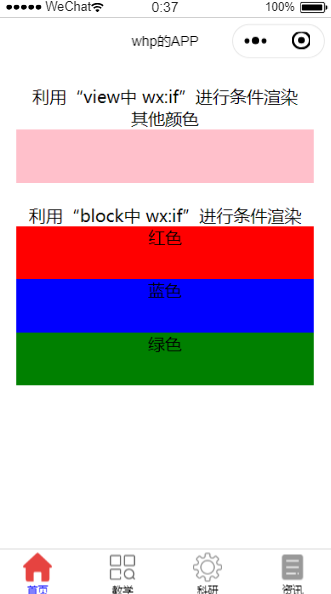

## `v4.4.0` 变量作用域和模块化

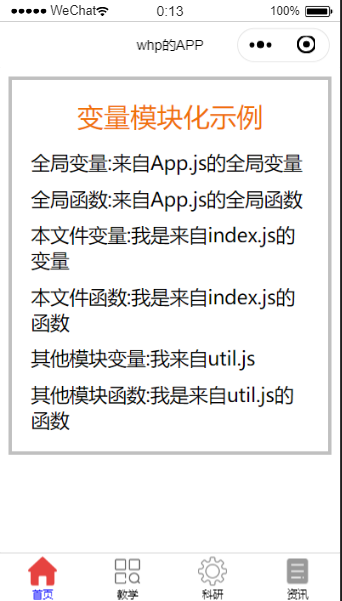

## `v4.3.0` 事件和数据的绑定

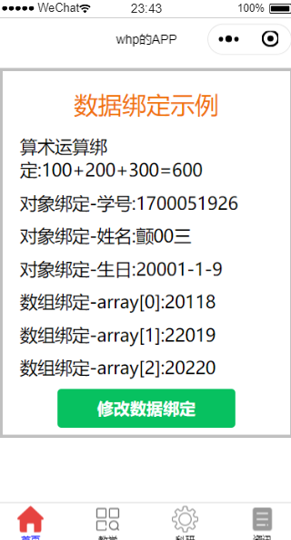

## `v4.2.0` 控制台展示页面的周期函数的调用

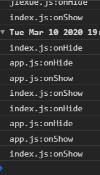

## `v4.1.1-p2` 分页导航标题和背景颜色设置

## `v4.1.0` tabBar和基本架构

## `v3.7.0` 根据作业完成计时器

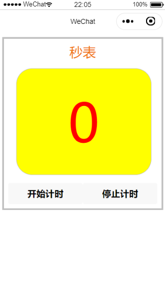

## `v3.6.0` 变化的三色旗

## `v3.5.0` 计时器

## `v3.4.0` 随机数求和

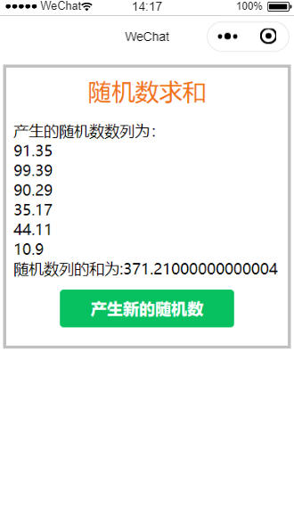
